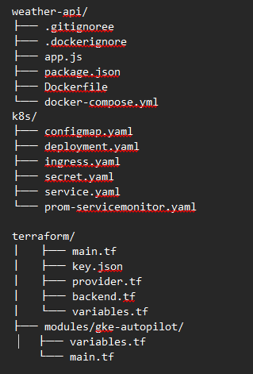

# Weather API - GKE Autopilot Deployment

## Contents

1. [Overview](#overview)  
2. [Prerequisites](#prerequisites)  
   2.1. [List of tools used](#list-of-tools-used)  
   2.2. [Configure gcloud CLI in the builder machine](#configure-gcloud-cli-in-the-builder-machine)  
   2.3. [Repository Structure](#repository-structure)  
3. [Setup Instructions](#setup-instructions)  
   3.1. [Local Development](#local-development)  
   3.2. [Kubernetes Deployment - Provision GKE Cluster (Terraform)](#kubernetes-deployment---provision-gke-cluster-terraform)  
4. [CI/CD Pipeline - Jenkins Setup](#cicd-pipeline---jenkins-setup)  
   4.1. [Required Plugins](#required-plugins)  
   4.2. [Pipeline Steps](#pipeline-steps)  
   4.3. [Github & Dockerhub Authentication](#github--dockerhub-authentication)  
   4.4. [Setup a Jenkins Pipeline](#setup-a-jenkins-pipeline)  
5. [Monitoring Stack](#monitoring-stack)  
   5.1. [Install Prometheus & Grafana](#install-prometheus--grafana)  
   5.2. [Configure Scraping](#configure-scraping)  
6. [Accessing Services](#accessing-services)  

---

## Overview

A Dockerized REST API that:

- Provides weather data for Dhaka via WeatherAPI.com at `/api/hello`
- Exposes health metrics at `/api/health`
- Automates the entire process with CI/CD
- Deploys on GKE Autopilot with:
  - Zero-downtime
  - Prometheus for metrics collection
  - Grafana for visualization
  - Terraform for infrastructure-as-code

---

## Prerequisites

Install and configure all the following tools and software.

### List of tools used

| Tool        | Version | Installation Guide         |
|-------------|---------|----------------------------|
| Node.js     | ≥18.x   | [nodejs.org](https://nodejs.org) |
| Docker      | ≥20.10  | [docs.docker.com](https://docs.docker.com) |
| Helm        | ≥3.8    | [helm.sh](https://helm.sh) |
| Terraform   | ≥1.3    | [terraform.io](https://terraform.io) |
| gcloud CLI  | ≥400.0  | [cloud.google.com](https://cloud.google.com) |
| kubectl     | ≥1.25   | [kubernetes.io](https://kubernetes.io) |

### Configure gcloud CLI in the builder machine

In order to use terraform in GCP, we must authenticate for terraform in the host machine.

```bash
gcloud auth login
```

Make sure to login with the service account that will be used to build the infrastructure within the cloud project.

The service account will require the following IAM roles to run terraform actions:

- `roles/storage.admin` – for storing remote backend and state locking
- `roles/container.clusterAdmin` – for Kubernetes-autopilot cluster creation
- `roles/compute.networkAdmin` – for VPC & subnet creation
- `roles/iam.serviceAccountAdmin` – for workload identity

Now to ensure security best practice generate a JSON key of the service account and store it safely to use the service account.

```bash
gcloud iam service-accounts keys create /home/mmh_sheshir/DevOps_Mahmudul/terraform/key.json   --iam-account=terraform-ci@YOUR_PROJECT_ID.iam.gserviceaccount.com
```

### Repository Structure




---

## Setup Instructions

### Local Development

Pull the source code from the remote repository:

```bash
git clone https://github.com/yourusername/weather-api.git
cd weather-api
```

Install dependencies:

```bash
npm install
```

Run locally (requires `.env`):

```bash
npm start
```

To run the Application locally please modify the `.env` with the given `api_key`.

> **NOTE**: For test purposes the `.env` file in the repository contains the `api_key`. However, in production environments, it is restricted to upload the `.env` file.

```dotenv
WEATHER_API_KEY=[hereeeeeee]
SERVER_NAME=server-1
PORT=3000
```

### Kubernetes Deployment - Provision GKE Cluster (Terraform)

To provision the required cloud infrastructure modules (VPC, subnets, GKE-autopilot), ensure gcloud CLI is configured with a designated service account and a GCS bucket named `dev-tof-tf-rem` exists in the same GCP project.

```bash
cd terraform
terraform init
terraform apply 
```

After creation, the cluster can only be accessed from the `authorized_network`. In this case, it is any machine using the organization’s network titled “Brainstation”.

To connect to the cluster:

- Go to **LEFT NAVIGATION BAR > KUBERNETES ENGINE**
- Select the cluster `sheshir-dev-cluster-autopilot`
- Click `connect` and run the provided gcloud command from an authorized machine:

```bash
gcloud container clusters get-credentials sheshir-dev-cluster-autopilot --region asia-southeast1 --project dev-tof-sheshir
```

Retrieve the `.kubeconfig` file to configure the CI/CD pipeline later.

---

## CI/CD Pipeline - Jenkins Setup

### Required Plugins

- Docker Pipeline
- Kubernetes CLI
- Terraform

### Pipeline Steps

In order to configure a fully functional Jenkins pipeline, we need to add the following authentication credentials to the Jenkins environment:

- **Github authentication** – for running SCM job and pulling source code
- **Docker authentication** – for building and pushing images
- **Kubernetes authentication** – for deploying services into the cluster

### Github & Dockerhub Authentication

To setup the global authentication:

`Manage Jenkins` → `Security` → `Credentials` → `Store scoped to Jenkins`  
Then:

- Select `System` → `Global credentials` → `Add Credentials`  
- Use `username/password` for both GitHub and DockerHub

| Credential             | Name             |
|------------------------|------------------|
| GitHub                 | `git-sheshir`    |
| DockerHub              | `docker-sheshir` |
| Kubernetes (kubeconfig) | `kubeconfig`     |

> For Kubernetes, create a separate domain:  
> `Credentials` → `System` → `Add domain` → `kube-domain` → `Add credentials` → `Kind`: `Secret text`  
> Use the content of `kubeconfig.txt` as the secret text.

### Setup a Jenkins Pipeline

To create the pipeline:

1. `Dashboard` → `Enter an Item name` → select `Pipeline`
2. Under `Triggers`:  
   - Enable `Build when a change is published`
   - Set the repository URL
   - Select `Build on branch created`

Set pipeline source to SCM:

- `Definition`: `Pipeline script from SCM`
- `SCM`: Git
- `Repository URL`
- `Credentials`: Select `git-sheshir`
- `Branch to build`: `*/master`
- `Script Path`: `Jenkinsfile`

---

## Monitoring Stack

### Install Prometheus & Grafana

Install the Helm chart from Jenkins (connected to GKE):

```bash
helm install monitoring prometheus-community/kube-prometheus-stack   --namespace monitoring   --create-namespace
```

### Configure Scraping

```bash
kubectl apply -f k8s/prom-servicemonitor.yaml
```

---

## Accessing Services

| Service      | Command                                                                 | Access URL                  |
|--------------|--------------------------------------------------------------------------|-----------------------------|
| Weather API  | `kubectl get ingress`                                                   | `http://ip`                 |
| Grafana      | `kubectl port-forward svc/monitoring-grafana 3000:80 -n monitoring`     | `http://ip:3000` (`admin/admin`) |
| Prometheus   | `kubectl port-forward svc/monitoring-prometheus 9090 -n monitoring`     | `http://ip:9090`            |
